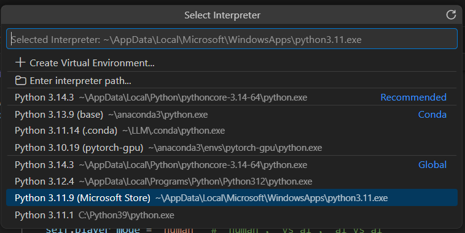

<h2>How to run the python script in Visual Studio Code?</h2>

1. Press Ctrl + Shift + P to open Command Palette
2. Type Python: Select Interpreter
3. Select Python 3.11.9 (Microsoft Store) ~\AppData\Local\Microsoft\WindowsApps\python.3.11.exe

 
